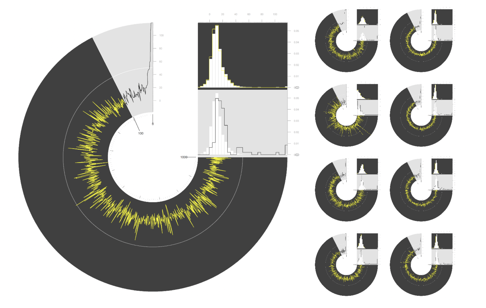
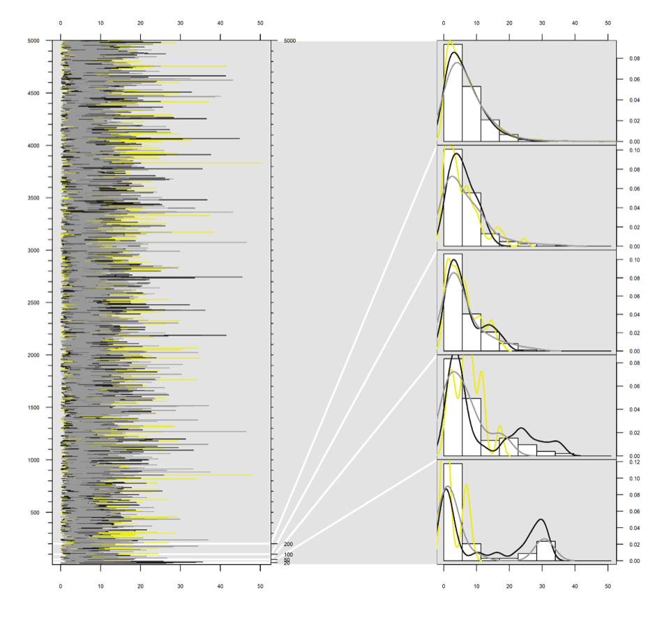
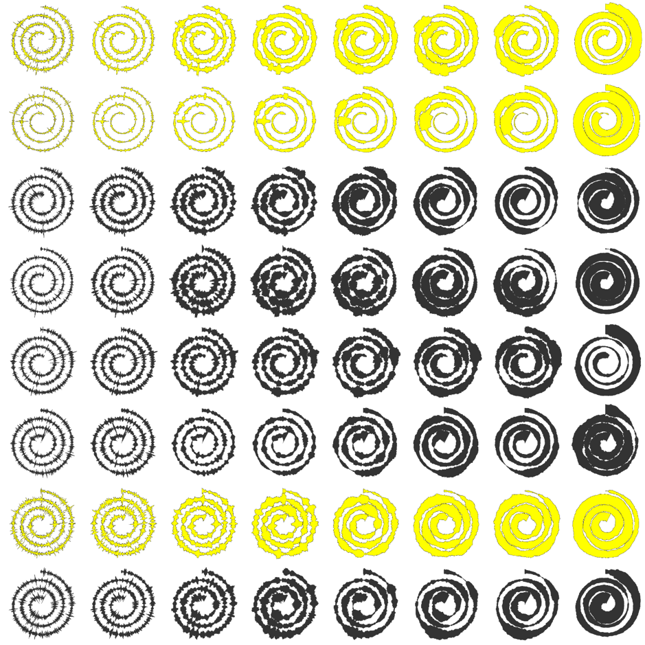

<!-- badges: start -->

[](https://www.repostatus.org/#active)
[](https://codecov.io/gh/WarwickCIM/backfillz)
[](https://github.com/WarwickCIM/backfillz/actions)
[](https://opensource.org/licenses/MIT)
<!-- badges: end -->


# New View of MCMC

Backfillz.R provides new visual diagnostics for understanding MCMC (Markov Chain Monte Carlo) analyses and outputs. MCMC chains can defy a simple line graph. Unless the chain is very short (which isn’t often the case), plotting tens or hundreds of thousands of data points reveals very little other than a ‘trace plot’ where we only see the outermost points. Common plotting methods may only reveal when an MCMC really hasn’t worked, but not when it has.
BackFillz.R slices and dices MCMC chains so increasingly parameter rich, complex analyses can be visualised meaningfully. What does ‘good mixing’ look like? Is a ‘hair caterpillar’ test verifiable? What does a density plot show and what does it hide?

# Quick Start

```r
install.packages(devtools)
devtools::install_github('warwickCIM/backfillz')
library(backfillz)

# convert sample data to backfillz object
x <- as_backfillz(sample_stanfit)

# change theme
x <- set_theme(x, 'demo 1')

# plot via generic plot method
x <- plot(x, plot_type = 'slice_histogram')

# create prototype plots
x <- plot_slice_histogram(x)
x <- plot_trace_dial(x)
x <- plot_spiral_stream(x)
```

# Current prototype plots

## Pretzel Plot – plot_trace_dial()

This plot shows the chain and summary histograms in a format that can be easily arranged as a grid. The trace plot is stretched, clearly indicating ‘burn-in’, with density plots showing the burn-in and remainder of the chain in context.



## Slice plot - plot_slice_histogram()

By partitioning chain slices, in a faceted view, users can assess chain convergence. The slices are currently specified by the user and display density plots for each slice. Have my chains converged? The slice plot offers a clear view of when and how convergence is achieved. Further statistical diagnostics can be embedded in these plots as colour encodings or additional layers and annotations.



## Splash plot - plot_spiral_stream()

Based on a Theodorus spiral, we turn MCMC chains into glyphs and extract properties to answer – What does ‘good mixing’ look like? In these plots variance windows are calculated across chains and parameters. The glyphs have clear diagnostic features and will allow gridded plots to investigate large numbers of parameters.



# Acknowledgements

We are grateful for funding from the Alan Turing Institute within the ‘Tools, Practices and Systems’ theme. Initial user research was carried out by GJM on the ‘2020 Science’ programme (www.2020science.net/) funded by the EPSRC Cross-Discipline Interface Programme (grant number EP/I017909/1).
